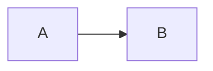
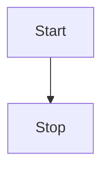
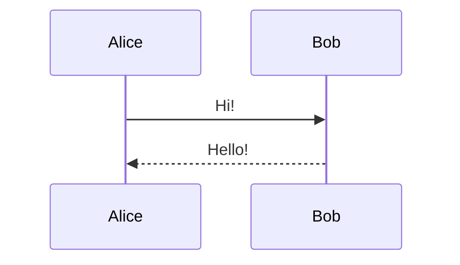
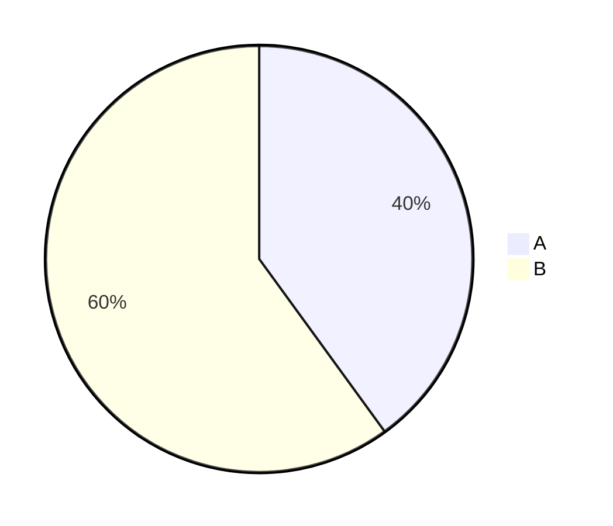

# How to Use Mermaid Diagrams

## ⚠️ IMPORTANT: You Must Wrap Code in Fenced Blocks!

Mermaid code from websites like https://mermaid.ai/ needs to be wrapped in markdown code blocks.

---

## ❌ WRONG - This Won't Render:

```
graph TD
    A --> B
```

Just pasting raw mermaid code won't work!

---

## ✅ CORRECT - This Will Render:

You need to wrap it like this:

````markdown

````

---

## 📝 Step-by-Step:

### 1. Copy Code from Mermaid Website
Go to https://mermaid.ai/ and copy any diagram code, for example:
```
graph LR
    A --> B
```

### 2. In Your Editor, Type:
```
```mermaid
```
(Three backticks, then the word "mermaid")

### 3. Paste the Code:
```


### 4. Close the Block:
````

````
(Three backticks at the end)

### 5. Done!
The diagram will render automatically!

---

## 🎯 Quick Template:

Copy this template and replace `YOUR_CODE_HERE`:

````markdown
```mermaid
YOUR_CODE_HERE
```
````

---

## 📚 Examples:

### Flowchart:
````markdown

````

### Sequence:
````markdown

````

### Pie Chart:
````markdown

````

---

## 💡 Pro Tip:

Open `mermaid-test-simple.md` to see working examples you can copy and modify!

---

## 🔗 Resources:

- **Mermaid Live Editor**: https://mermaid.live/ (test your code)
- **Mermaid Docs**: https://mermaid.js.org/
- **Our Demo**: `mermaid-demo.md` (9 diagram types)
- **Simple Test**: `mermaid-test-simple.md` (quick examples)
