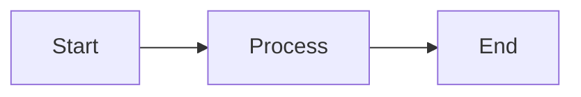
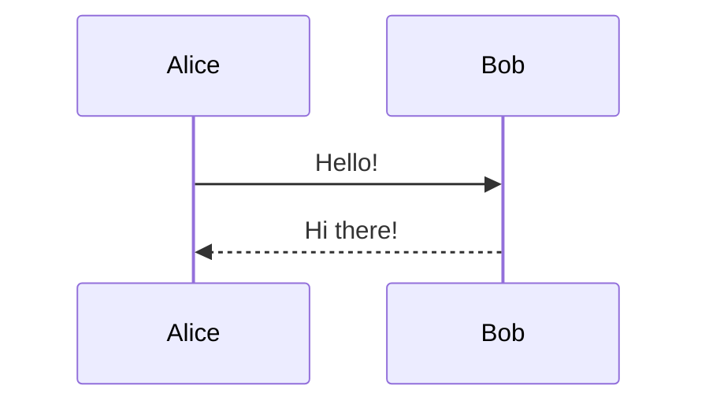
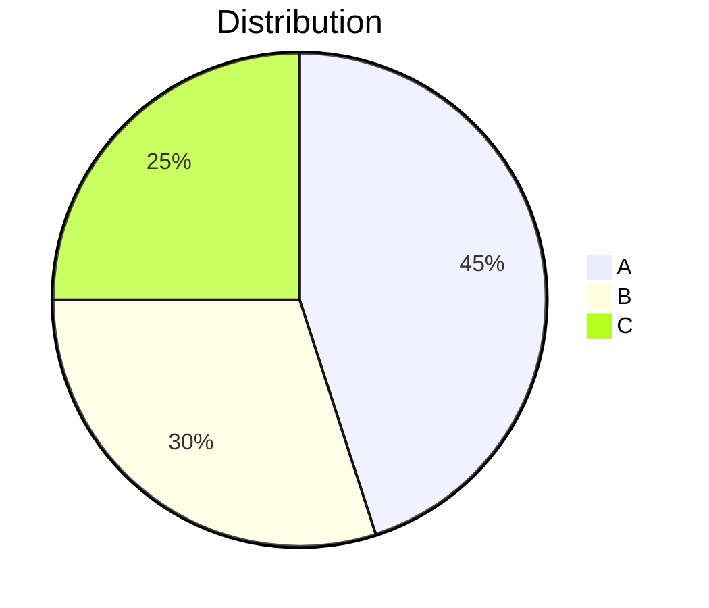

# ✅ Mermaid.js Implementation Complete

Full Mermaid.js diagram rendering support has been integrated into your Markdown editor.

## 📦 Files Created/Modified

### New Files:
1. **`src/mermaid-renderer.js`** - Modular Mermaid renderer with debouncing
2. **`mermaid-demo.md`** - Comprehensive demo with 9 diagram types
3. **`MERMAID-IMPLEMENTATION.md`** - This documentation

### Modified Files:
1. **`index.html`** - Added mermaid-renderer.js script tag
2. **`src/main.js`** - Integrated rendering in convert() and renderPaperLayout()
3. **`public/css/style.css`** - Added mermaid diagram styles (light/dark theme)

---

## 🎯 Features Implemented

### Core Functionality:
✅ Automatic detection of ```mermaid code blocks  
✅ Conversion to `<div class="mermaid">` containers  
✅ Lazy loading of Mermaid.js from CDN (v10 latest)  
✅ Safe initialization (prevents double-init errors)  
✅ Re-rendering on every markdown update  
✅ Multiple diagrams per page support  
✅ No conflicts with other code blocks  
✅ Graceful error handling with visual feedback  

### Performance:
✅ Debounced rendering (300ms) for live typing  
✅ Efficient re-rendering only when needed  
✅ Async loading to avoid blocking  

### Theme Support:
✅ Automatic dark/light theme detection  
✅ Mermaid theme switches with editor theme  
✅ Custom styled error messages for both themes  

### Integration:
✅ Works in normal preview mode  
✅ Works in paper layout mode  
✅ Preserves line mapping for scroll sync  
✅ Compatible with edit mode  

---

## 🔧 How It Works

### 1. Detection Phase
When markdown is converted to HTML, `marked.js` creates:
```html
<pre><code class="language-mermaid">
graph TD
    A --> B
</code></pre>
```

### 2. Processing Phase
`MermaidRenderer.processMermaidBlocks()` finds these blocks and converts them to:
```html
<div class="mermaid">
graph TD
    A --> B
</div>
```

### 3. Rendering Phase
`mermaid.render()` transforms the div content into SVG diagrams:
```html
<div class="mermaid mermaid-rendered">
    <svg>...</svg>
</div>
```

### 4. Error Handling
If rendering fails, shows:
```html
<div class="mermaid mermaid-error-state">
    <div class="mermaid-error">
        ⚠️ Error message
        <pre>Original code</pre>
    </div>
</div>
```

---

## 🧪 Testing

### Test with Demo File:
1. **Open the editor**
2. **Load `mermaid-demo.md`** (or paste its content)
3. **Watch diagrams render** automatically
4. **Try editing** - diagrams update on typing (debounced)
5. **Toggle dark mode** - diagrams adapt to theme
6. **Enable paper layout** - diagrams render in paginated view

### Supported Diagram Types:
- Flowchart / Graph
- Sequence Diagram
- Class Diagram
- State Diagram
- Gantt Chart
- Pie Chart
- Entity Relationship Diagram
- Git Graph
- Journey Diagram
- And more...

### Test Error Handling:
The demo includes an intentionally broken diagram to verify error display works correctly.

---

## 🎨 Styling

### Light Theme:
- Diagrams: Light gray background (#f8f9fa)
- Borders: Subtle gray (#e2e8f0)
- Errors: Red background with clear messaging

### Dark Theme:
- Diagrams: Dark background (#1a1d23)
- Borders: Dark gray (#3d3d3d)
- Errors: Dark red background with light text
- Mermaid uses 'dark' theme automatically

---

## 📝 Usage Examples

### Basic Flowchart:
````markdown

````

### Sequence Diagram:
````markdown

````

### Pie Chart:
````markdown

````

---

## 🔍 Console Logging

The implementation includes helpful console logs:

```
✅ Mermaid.js loaded
✅ Mermaid initialized with theme: dark
🔍 Found 3 mermaid diagram(s)
✅ Rendered mermaid diagram 1/3
✅ Rendered mermaid diagram 2/3
✅ Rendered mermaid diagram 3/3
```

Or if errors occur:
```
❌ Failed to render mermaid diagram 1: Syntax error
```

---

## 🚀 API Reference

### MermaidRenderer Module

```javascript
// Render immediately
MermaidRenderer.render(containerElement);

// Render with debounce (for live typing)
MermaidRenderer.renderDebounced(containerElement);

// Check if loaded
if (MermaidRenderer.isLoaded()) { ... }

// Update theme
MermaidRenderer.updateTheme('dark');
```

---

## 🔒 Security

- Uses Mermaid's `securityLevel: 'loose'` for full functionality
- Content is already sanitized by DOMPurify before Mermaid processes it
- No XSS vulnerabilities introduced
- CDN loaded from trusted source (jsdelivr.net)

---

## ⚡ Performance

- **Debounce delay**: 300ms (prevents excessive re-renders while typing)
- **Lazy loading**: Mermaid.js only loads when first diagram is detected
- **Efficient updates**: Only re-renders when content changes
- **No blocking**: Async rendering doesn't freeze the UI

---

## 🐛 Troubleshooting

### Diagrams not rendering?
1. Check browser console for errors
2. Verify internet connection (CDN access)
3. Check if code block has `mermaid` language tag
4. Try the demo file to verify setup

### Syntax errors?
- Mermaid has strict syntax requirements
- Check [Mermaid documentation](https://mermaid.js.org/)
- Error messages show in red boxes with original code

### Theme not switching?
- Verify `data-theme` attribute on `<html>` element
- Check if theme detection logic matches your app's theme system

---

## 📚 Resources

- [Mermaid.js Documentation](https://mermaid.js.org/)
- [Mermaid Live Editor](https://mermaid.live/) - Test diagrams
- [Diagram Syntax Reference](https://mermaid.js.org/intro/syntax-reference.html)

---

## ✨ Summary

Mermaid.js is now fully integrated! Just write ```mermaid code blocks in your markdown and they'll automatically render as beautiful SVG diagrams. The implementation is:

- **Clean**: Modular, no global pollution
- **Fast**: Debounced, efficient
- **Robust**: Error handling, theme support
- **Complete**: Works everywhere in your app

**Try it now with `mermaid-demo.md`!** 🎉
