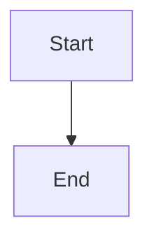
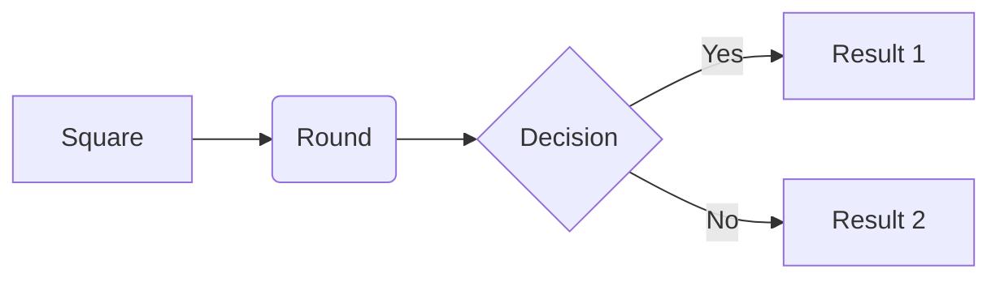
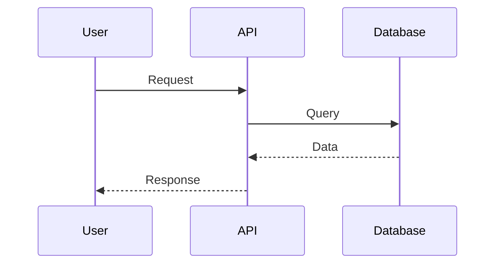
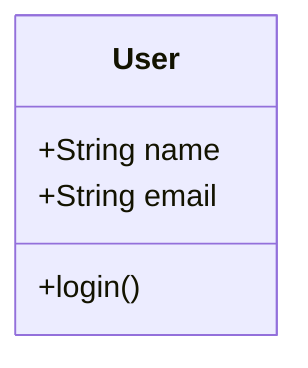
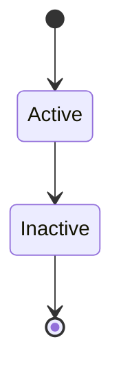
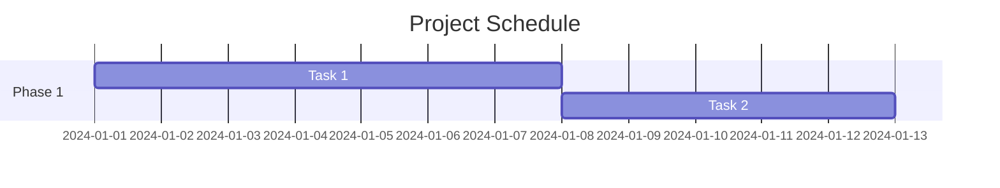
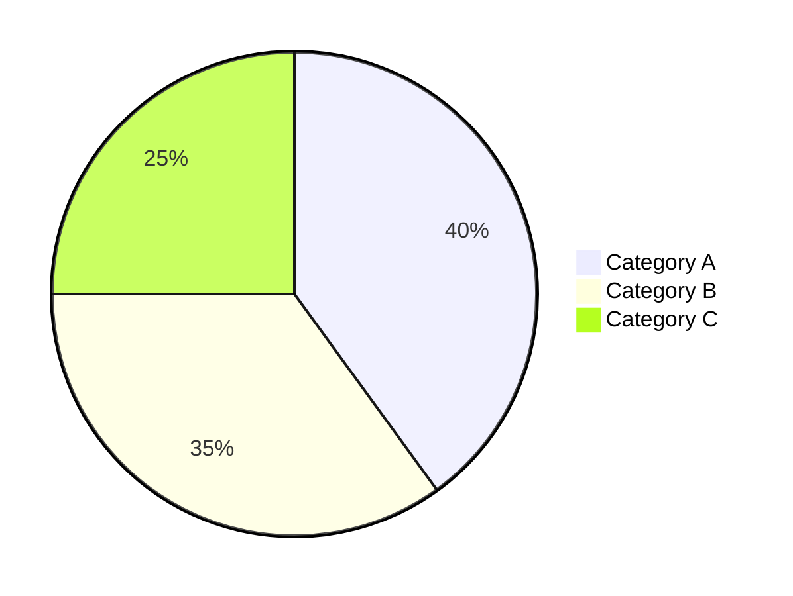

# Mermaid.js Quick Start Guide

## 🚀 How to Use

Just write a code block with `mermaid` language tag:

````markdown

````

That's it! The diagram renders automatically.

---

## 📊 Common Diagram Types

### 1. Flowchart
````markdown

````

### 2. Sequence Diagram
````markdown

````

### 3. Class Diagram
````markdown

````

### 4. State Diagram
````markdown

````

### 5. Gantt Chart
````markdown

````

### 6. Pie Chart
````markdown

````

---

## 💡 Tips

1. **Syntax matters** - Mermaid is strict about formatting
2. **Test first** - Use [mermaid.live](https://mermaid.live/) to test complex diagrams
3. **Errors show** - If syntax is wrong, you'll see a red error box
4. **Live updates** - Diagrams re-render as you type (with 300ms delay)
5. **Theme aware** - Diagrams automatically match light/dark mode

---

## 🎨 Styling

Diagrams automatically:
- Match your editor theme (light/dark)
- Center in the preview
- Scale responsively
- Work in paper layout mode

---

## 🔗 Learn More

- Full demo: `mermaid-demo.md`
- Documentation: `MERMAID-IMPLEMENTATION.md`
- Official docs: [mermaid.js.org](https://mermaid.js.org/)
