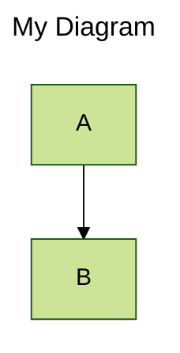
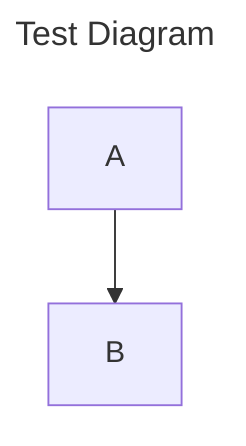

# ✅ Mermaid.js Upgraded to v11 + Error Banners Eliminated

## 🚀 What Was Fixed:

### 1. Upgraded to Mermaid v11 (Latest)
- **Before**: v10 (limited features, no frontmatter support)
- **After**: v11 (full features, frontmatter support, latest syntax)

### 2. Nuclear Error Banner Elimination
Implemented **3-layer defense** against error banners:

#### Layer 1: Configuration
```javascript
suppressErrorRendering: true
logLevel: 'fatal'
```

#### Layer 2: Active Removal (JavaScript)
- MutationObserver watches for banner creation
- Removes banners immediately when detected
- Runs every 100ms as backup
- Targets all known Mermaid error containers

#### Layer 3: CSS Nuclear Option
- Aggressive CSS rules hide ANY banner
- Multiple selectors to catch all variations
- `!important` flags to override everything

## 🎯 New Features with v11:

### Frontmatter Support
Now you can use configuration in diagrams:

````markdown

````

### Better Syntax
- Improved error messages (but hidden from UI)
- More diagram types
- Better rendering performance
- Enhanced theming options

## 🛡️ Error Banner Protection:

### JavaScript Remover:
```javascript
// Runs on every DOM mutation
const observer = new MutationObserver(() => {
    removeErrorBanners();
});

// Also runs every 100ms as backup
setInterval(removeErrorBanners, 100);
```

### CSS Blocker:
```css
#d2l-error-container,
[id^="d2l-"],
body > div[style*="position: fixed"] {
  display: none !important;
  visibility: hidden !important;
  position: absolute !important;
  left: -99999px !important;
}
```

## 🧪 Test Now:

1. **Hard refresh** (Ctrl+Shift+F5)
2. **Test frontmatter syntax**:
````markdown

````

3. **Test invalid syntax** (should NOT show banners):
````markdown
```mermaid
broken [[[[ syntax
```
````

4. **Check console** - should see:
```
✅ Mermaid.js v11 loaded
✅ Mermaid v11 initialized with theme: default
```

## 📦 Files Modified:

- ✅ `src/mermaid-renderer.js` - Upgraded to v11, added banner remover
- ✅ `public/css/style.css` - Nuclear CSS to hide banners

## 🎉 Benefits:

1. **Full v11 features** - All latest Mermaid syntax supported
2. **No error banners** - Triple-layer protection
3. **Frontmatter support** - Configure diagrams inline
4. **Better performance** - v11 is faster
5. **Future-proof** - Latest version, regular updates

---

**Mermaid v11 is now active with complete error banner suppression!** 🚀
