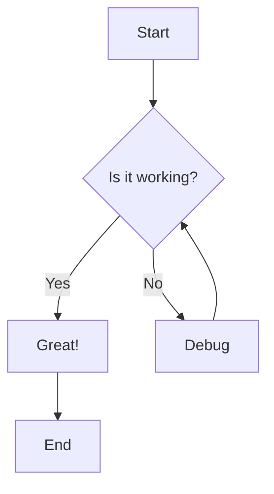
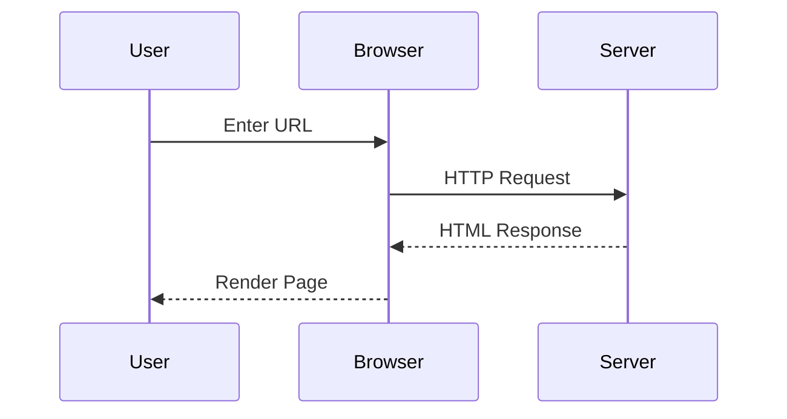
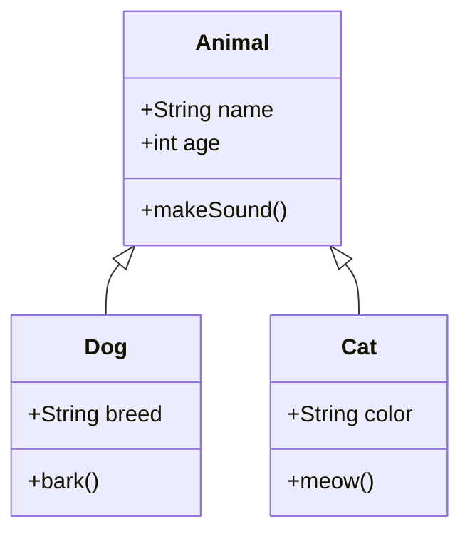
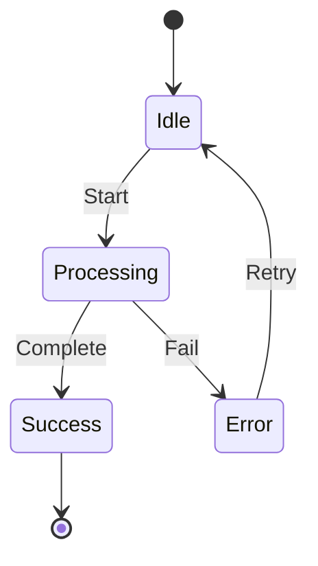
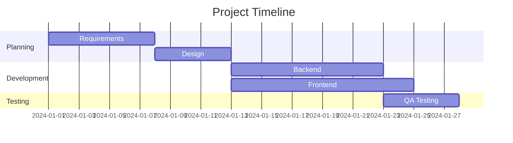
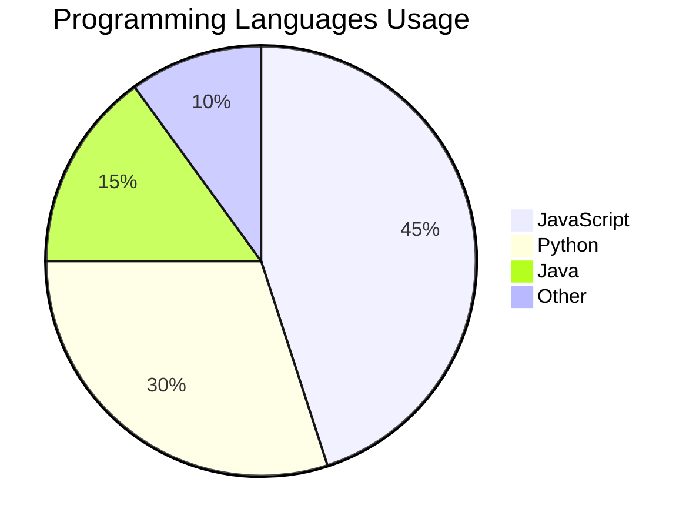
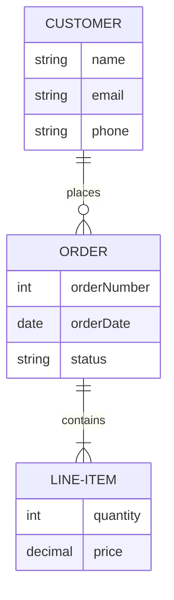
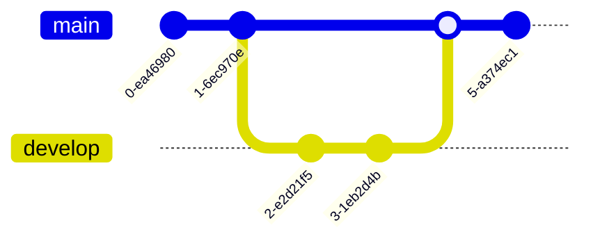
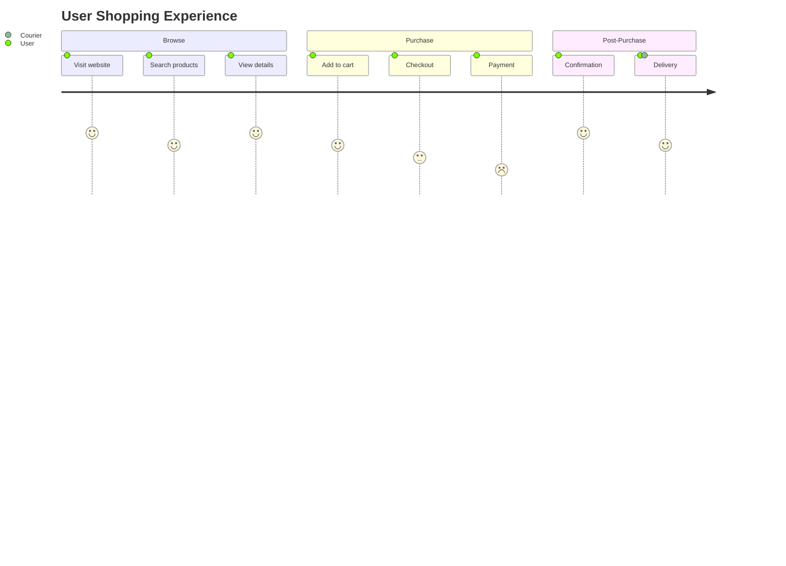

# Mermaid.js Diagram Examples

This document demonstrates various Mermaid diagram types rendered in the Markdown editor.

## Flowchart



## Sequence Diagram



## Class Diagram



## State Diagram



## Gantt Chart



## Pie Chart



## Entity Relationship Diagram



## Git Graph



## Journey Diagram



---

## Testing Error Handling

This is an intentionally broken diagram to test error handling:

```mermaid
graph TD
    A[Start] --> B[Missing closing bracket
    B --> C[End
```

---

**Note:** All diagrams above should render automatically. If you see code blocks instead of diagrams, check the browser console for errors.
