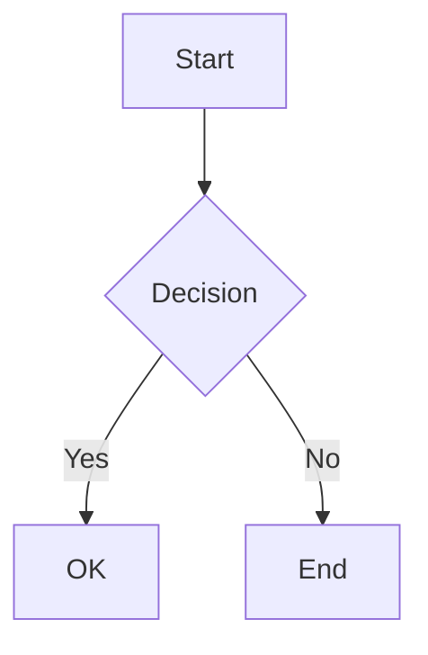
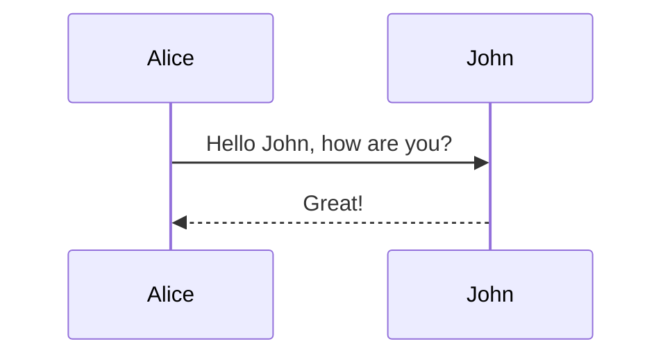
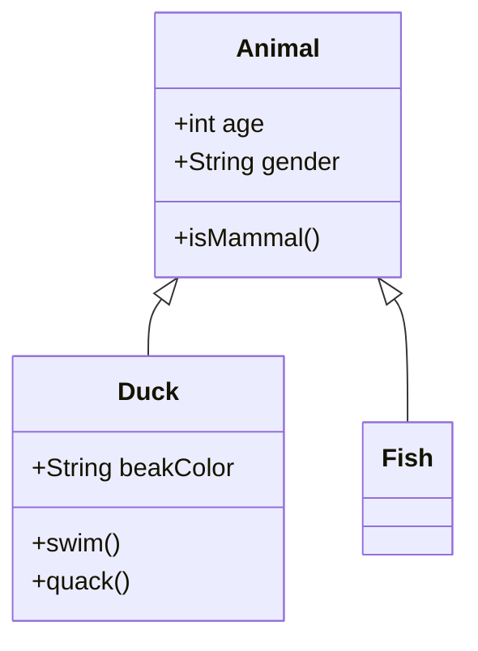

# Mermaid Test - Copy from Website

## Example 1: Simple Flowchart

Wrap the code in ```mermaid blocks:



## Example 2: Sequence Diagram



## Example 3: Class Diagram



## How to Use:

1. Copy mermaid code from https://mermaid.ai/
2. Paste it in your editor
3. Add ``` before and after
4. Add `mermaid` after the first ```
5. It will render!

## Wrong Way (Won't Render):
graph TD
    A --> B

## Right Way (Will Render):

