# Mermaid v11 Demo - All Features

## Test 1: Basic Flowchart (No Frontmatter)

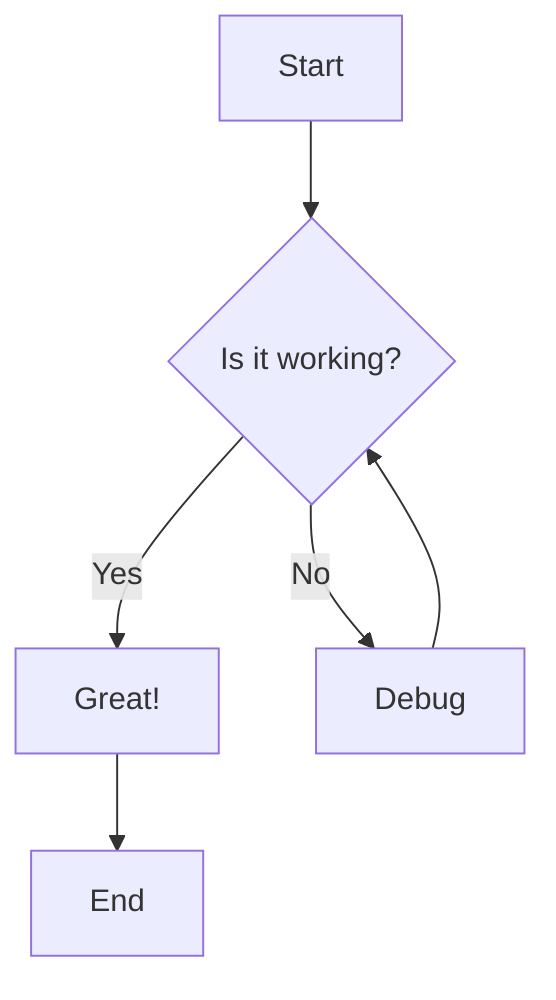
```mermaid
graph TD
    A[Start] --> B{Is it working?}
    B -->|Yes| C[Great!]
    B -->|No| D[Debug]
    D --> B
    C --> E[End]
```

## Test 2: Flowchart with Frontmatter

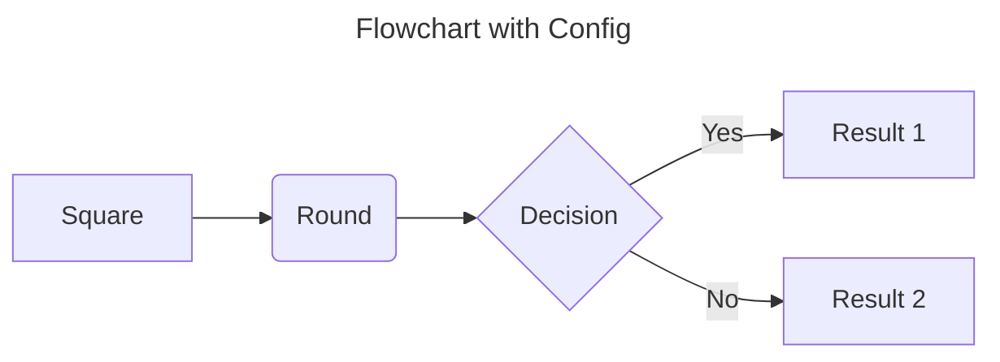
```mermaid
---
title: Flowchart with Config
---
graph LR
    A[Square] --> B(Round)
    B --> C{Decision}
    C -->|Yes| D[Result 1]
    C -->|No| E[Result 2]
```

## Test 3: Sequence Diagram

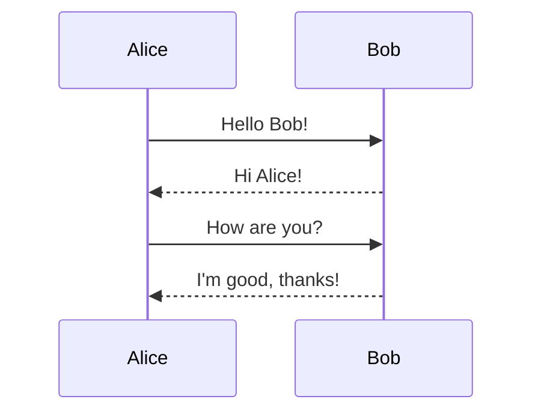
```mermaid
sequenceDiagram
    participant Alice
    participant Bob
    Alice->>Bob: Hello Bob!
    Bob-->>Alice: Hi Alice!
    Alice->>Bob: How are you?
    Bob-->>Alice: I'm good, thanks!
```

## Test 4: Sequence with Frontmatter

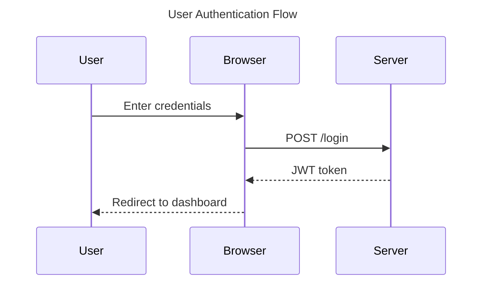
```mermaid
---
title: User Authentication Flow
---
sequenceDiagram
    participant User
    participant Browser
    participant Server
    User->>Browser: Enter credentials
    Browser->>Server: POST /login
    Server-->>Browser: JWT token
    Browser-->>User: Redirect to dashboard
```

## Test 5: Class Diagram

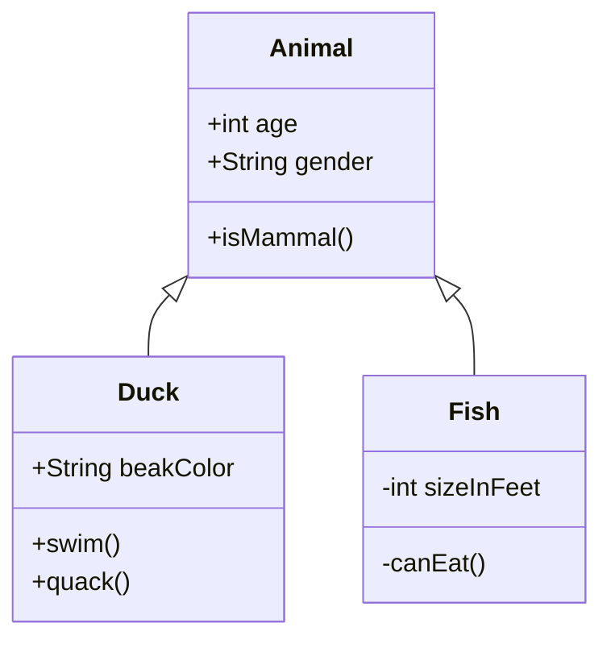
```mermaid
classDiagram
    Animal <|-- Duck
    Animal <|-- Fish
    Animal : +int age
    Animal : +String gender
    Animal: +isMammal()
    class Duck{
        +String beakColor
        +swim()
        +quack()
    }
    class Fish{
        -int sizeInFeet
        -canEat()
    }
```

## Test 6: State Diagram

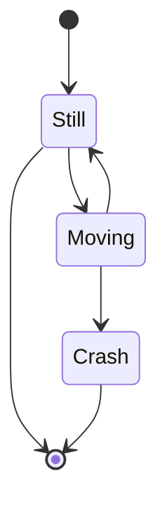
```mermaid
stateDiagram-v2
    [*] --> Still
    Still --> [*]
    Still --> Moving
    Moving --> Still
    Moving --> Crash
    Crash --> [*]
```

## Test 7: Gantt Chart (Basic)

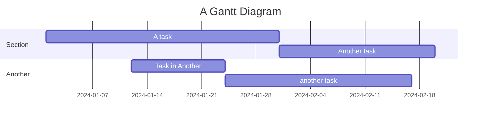
```mermaid
gantt
    title A Gantt Diagram
    dateFormat YYYY-MM-DD
    section Section
    A task           :a1, 2024-01-01, 30d
    Another task     :after a1, 20d
    section Another
    Task in Another  :2024-01-12, 12d
    another task     :24d
```

## Test 8: Gantt with Frontmatter (Your Example)

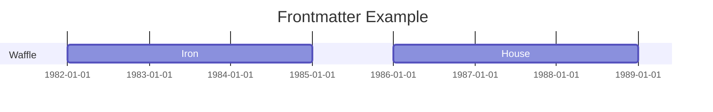
```mermaid
---
title: Frontmatter Example
displayMode: compact
---
gantt
    dateFormat YYYY
    section Waffle
    Iron  : 1982, 3y
    House : 1986, 3y
```

## Test 9: Pie Chart

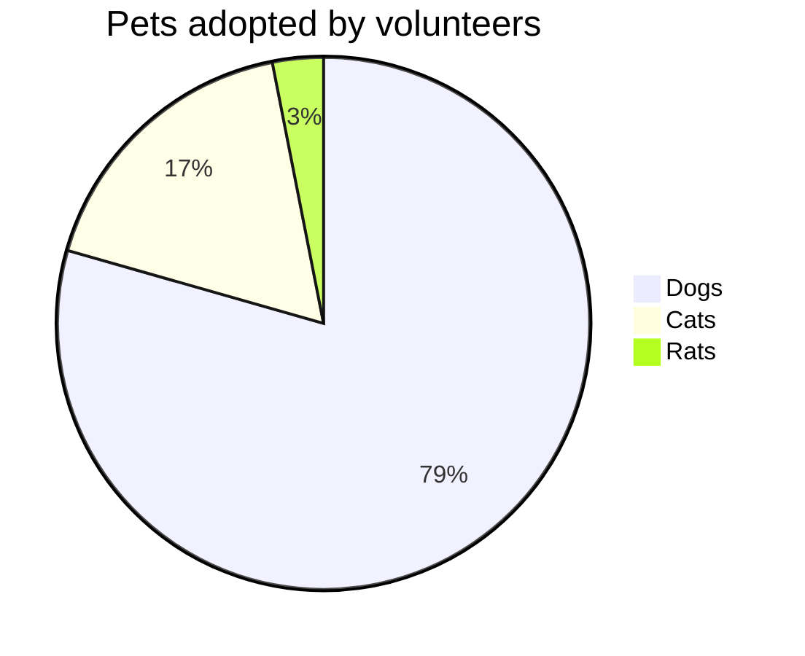
```mermaid
pie title Pets adopted by volunteers
    "Dogs" : 386
    "Cats" : 85
    "Rats" : 15
```

## Test 10: ER Diagram

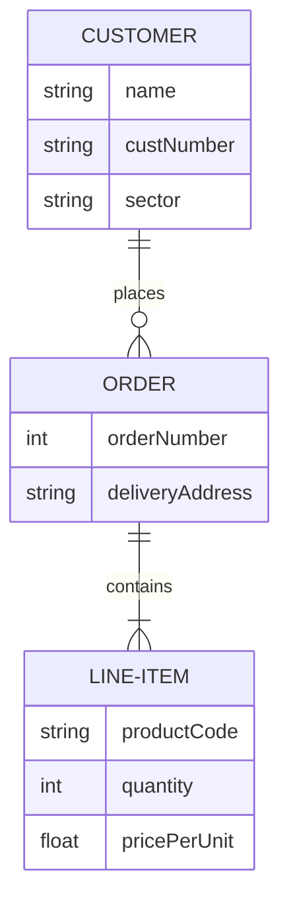
```mermaid
erDiagram
    CUSTOMER ||--o{ ORDER : places
    ORDER ||--|{ LINE-ITEM : contains
    CUSTOMER {
        string name
        string custNumber
        string sector
    }
    ORDER {
        int orderNumber
        string deliveryAddress
    }
    LINE-ITEM {
        string productCode
        int quantity
        float pricePerUnit
    }
```

## Test 11: Git Graph

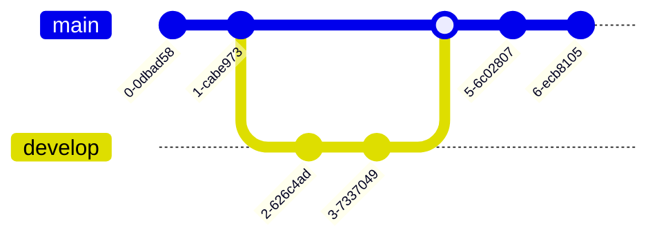
```mermaid
gitGraph
    commit
    commit
    branch develop
    checkout develop
    commit
    commit
    checkout main
    merge develop
    commit
    commit
```

## Test 12: Journey Diagram

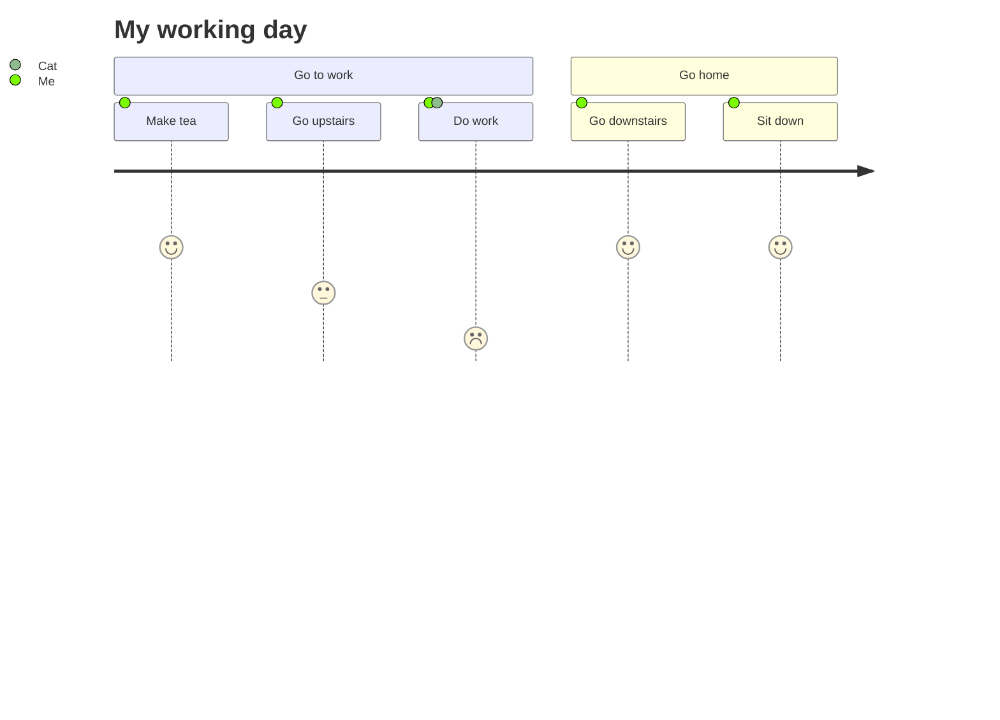
```mermaid
journey
    title My working day
    section Go to work
      Make tea: 5: Me
      Go upstairs: 3: Me
      Do work: 1: Me, Cat
    section Go home
      Go downstairs: 5: Me
      Sit down: 5: Me
```

## Test 13: Mindmap (v11 Feature)

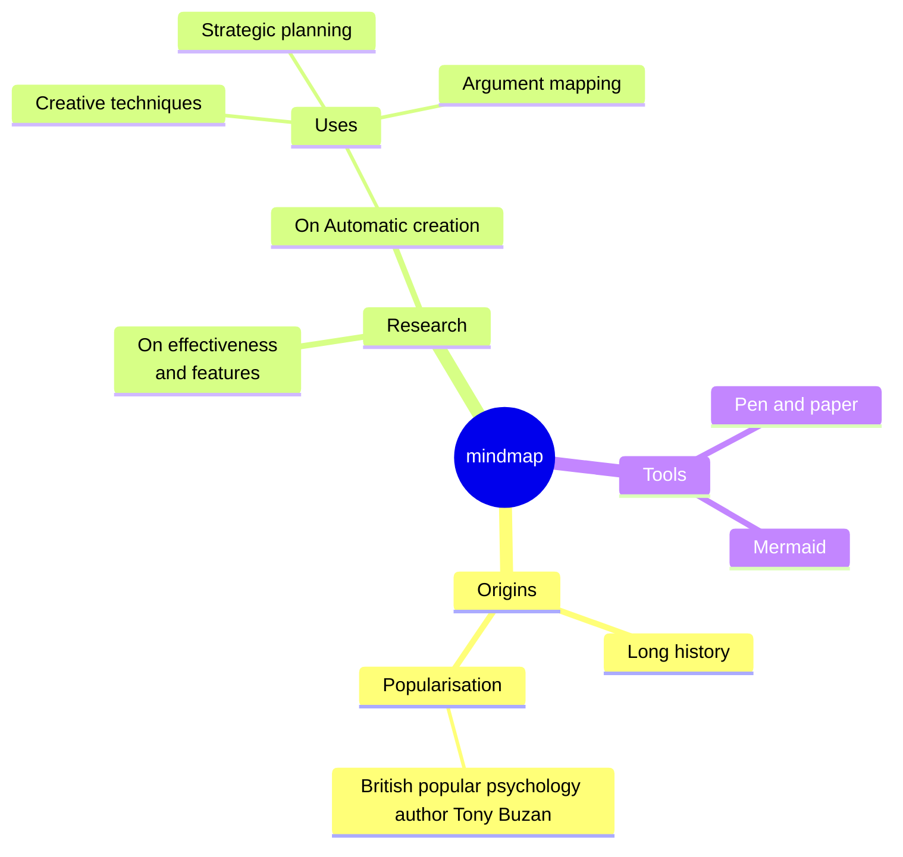
```mermaid
mindmap
  root((mindmap))
    Origins
      Long history
      ::icon(fa fa-book)
      Popularisation
        British popular psychology author Tony Buzan
    Research
      On effectiveness<br/>and features
      On Automatic creation
        Uses
            Creative techniques
            Strategic planning
            Argument mapping
    Tools
      Pen and paper
      Mermaid
```

## Test 14: Timeline (v11 Feature)

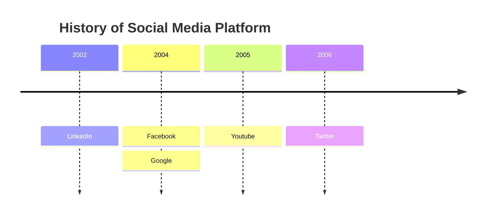
```mermaid
timeline
    title History of Social Media Platform
    2002 : LinkedIn
    2004 : Facebook
         : Google
    2005 : Youtube
    2006 : Twitter
```

## Test 15: Quadrant Chart (v11 Feature)

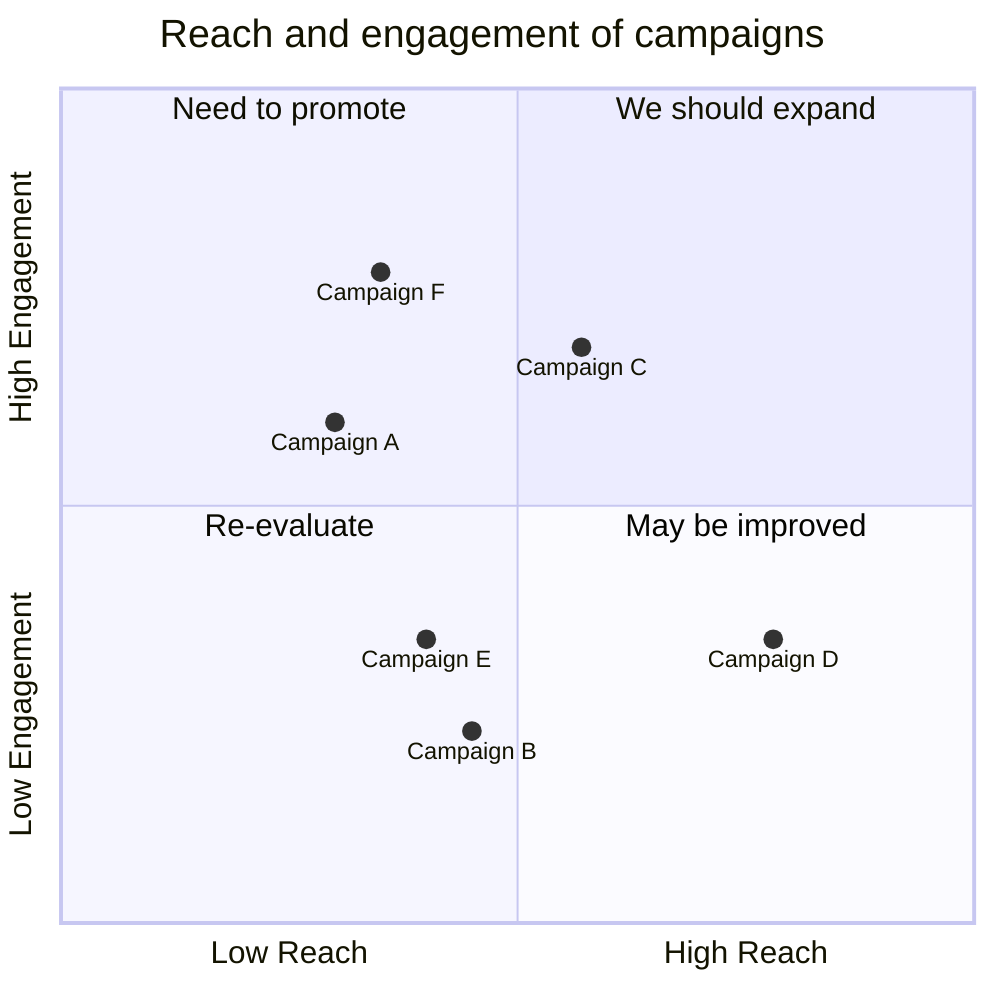
```mermaid
quadrantChart
    title Reach and engagement of campaigns
    x-axis Low Reach --> High Reach
    y-axis Low Engagement --> High Engagement
    quadrant-1 We should expand
    quadrant-2 Need to promote
    quadrant-3 Re-evaluate
    quadrant-4 May be improved
    Campaign A: [0.3, 0.6]
    Campaign B: [0.45, 0.23]
    Campaign C: [0.57, 0.69]
    Campaign D: [0.78, 0.34]
    Campaign E: [0.40, 0.34]
    Campaign F: [0.35, 0.78]
```

## Test 16: XY Chart (v11 Feature)

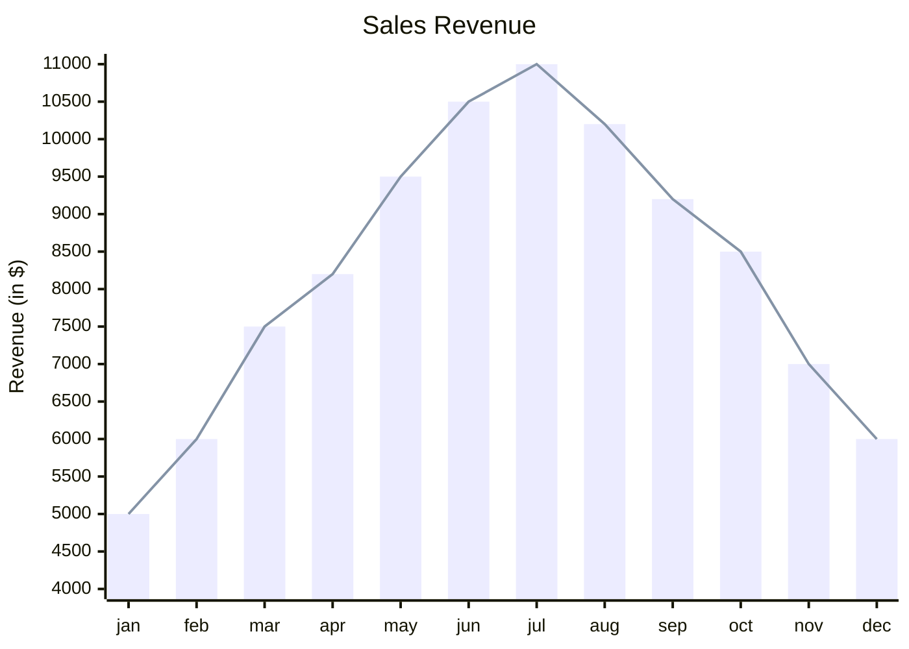
```mermaid
xychart-beta
    title "Sales Revenue"
    x-axis [jan, feb, mar, apr, may, jun, jul, aug, sep, oct, nov, dec]
    y-axis "Revenue (in $)" 4000 --> 11000
    bar [5000, 6000, 7500, 8200, 9500, 10500, 11000, 10200, 9200, 8500, 7000, 6000]
    line [5000, 6000, 7500, 8200, 9500, 10500, 11000, 10200, 9200, 8500, 7000, 6000]
```

## Test 17: Block Diagram (v11 Feature)

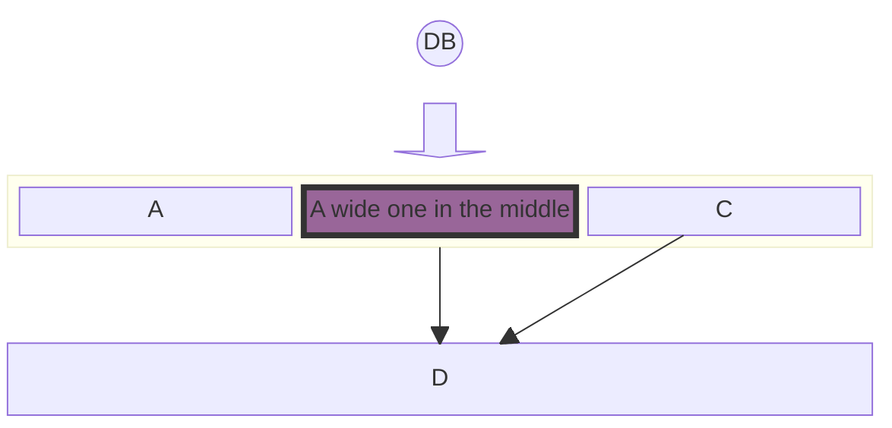
```mermaid
block-beta
columns 1
  db(("DB"))
  blockArrowId6<["&nbsp;&nbsp;&nbsp;"]>(down)
  block:ID
    A
    B["A wide one in the middle"]
    C
  end
  space
  D
  ID --> D
  C --> D
  style B fill:#969,stroke:#333,stroke-width:4px
```

## Test 18: Sankey Diagram (v11 Feature)

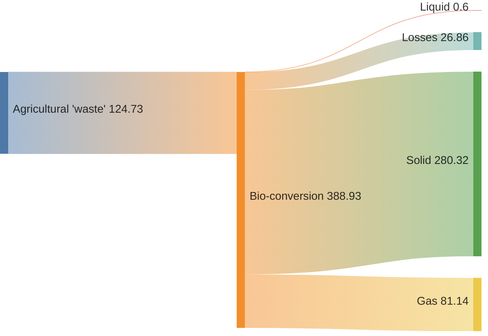
```mermaid
sankey-beta

%% source,target,value
Agricultural 'waste',Bio-conversion,124.729
Bio-conversion,Liquid,0.597
Bio-conversion,Losses,26.862
Bio-conversion,Solid,280.322
Bio-conversion,Gas,81.144
```

## Test 19: Architecture Diagram (v11 Feature)

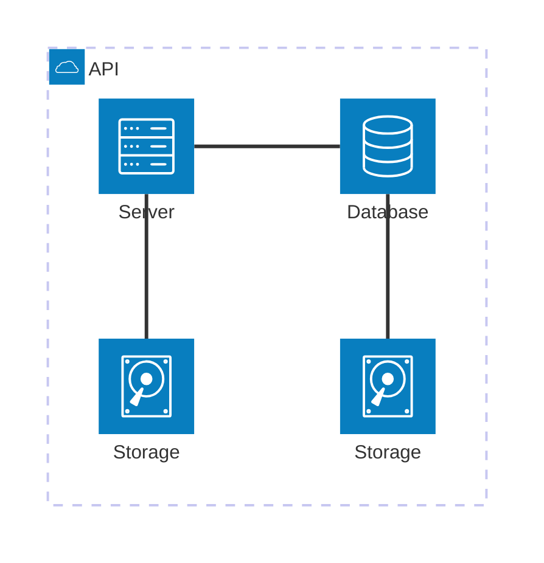
```mermaid
architecture-beta
    group api(cloud)[API]

    service db(database)[Database] in api
    service disk1(disk)[Storage] in api
    service disk2(disk)[Storage] in api
    service server(server)[Server] in api

    db:L -- R:server
    disk1:T -- B:server
    disk2:T -- B:db
```

## Test 20: Intentionally Broken (Error Test)

```mermaid
graph TD
    A[Missing bracket
    B --> C
```

---

**Instructions:**
1. Paste this entire file into your editor
2. Check console for any errors
3. Share the console output
4. Note which diagrams render and which don't
